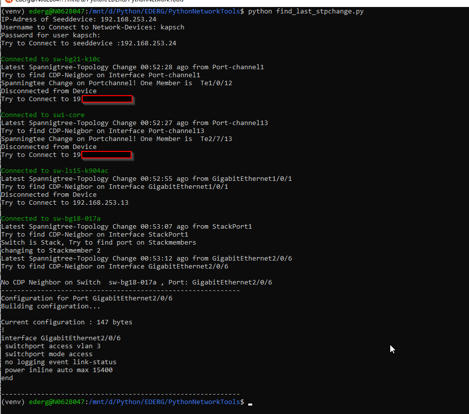

# networkautomation

### find_last_stpchange.py
I wanted to create a script to find the port where we get the last Spanningtree-Topology-Change.
I decidet to run this in a shell and use Python.

It asks for the IP-Address of a seeddevice and the login credentials.
Then it logs in and run the command "show spanning-tree detail | include last|from"
So it get all the STP-Changes, here I can iterate and find the shortes time ago.
At the Moment it only works when the change was in the last 24 houres. [Room for improvement.]

When it gets the port it tryes to get the CDP-Neighbor of that interface.
Here it takes care for portchannels und stackingport.
When the stp-change is on a portchannel it uses the last member from the Output of "show interface port-channel Number"
If the stp-change is on stacking-port, it gets the stackmembers and iterates over it until it gets a Port which isn't the stackport.

After getting CDP-Neighbor it connects to the IP-Adress of the CDP-Neighbor, and starts the whole process, like on the seeddevice.
When no CPP-Neighbor is found it prints the configuration of this interface

* Improvements: support for nxos and loopdetection

