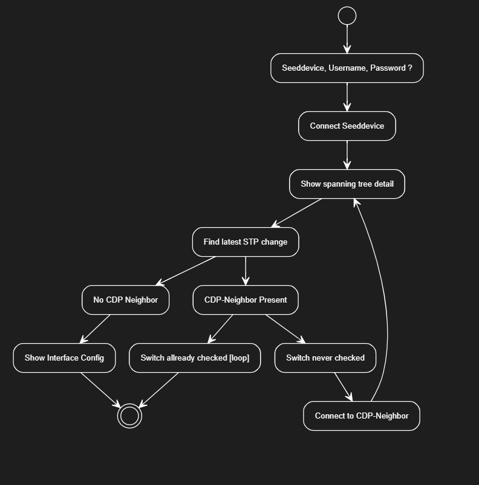
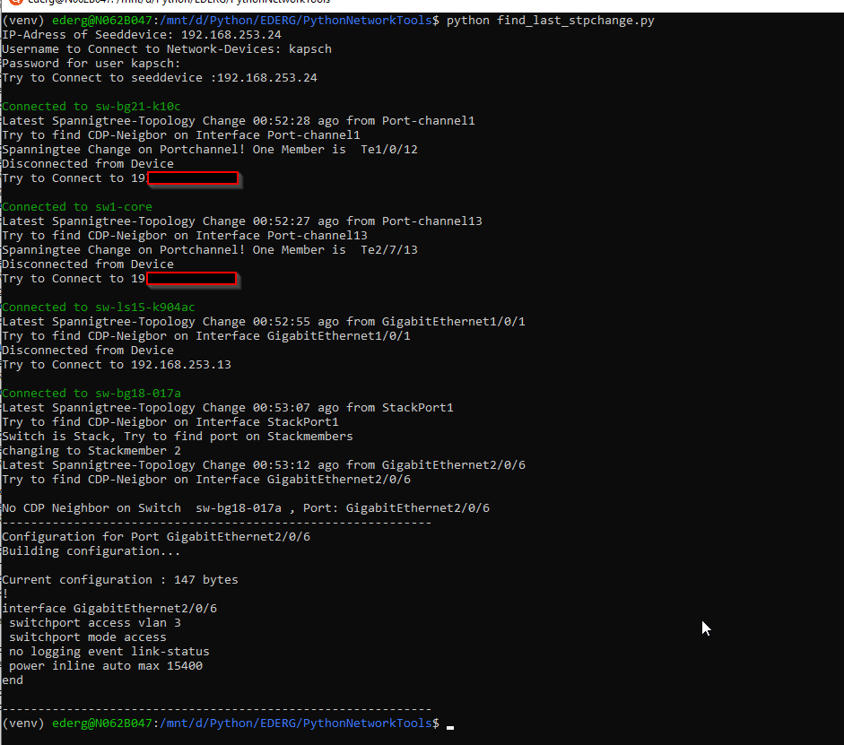

# networkautomation

## find_last_stpchange.py
I wanted to create a script to find the port where we get the last Spanningtree-Topology-Change.
I decided to run this in a shell and use Python.

### Installation and Usage
For connecting to the networkdevices 3rd-party library "Netmiko" is used.
Best practice is to install it in a virtual environment.
* Clone the repository
```
git clone https://github.com/edergernot/networkautomation
```
* go into directory
```
cd networkautomation
```
* create and activate virtual environment
```
python -m venv venv
venv/scrips/activate.bat   (windows)
source /venv/bin/
```
* Install required 3rd-party library
```
pip install netmiko, colorama
```

### How it workes:



It asks for the IP-Address of a seeddevice and the login credentials.
Then it logs in and run the command "show spanning-tree detail | include last|from"
So it get all the STP-Changes, here I can iterate and find the shortes time ago.
At the moment it only works when the change was in the last 24 houres. [Room for improvement.]

When it gets the port it tries to get the CDP-Neighbor of that interface.
Here it takes care for portchannels und stackingport.
When the STP-Change is on a portchannel it uses the last member from the output of "show interface port-channel NUMBER"
If the STP-Change is on stacking-port, it gets the stackmembers and iterates over it until it gets a Port which isn't the stackport.

After getting CDP-Neighbor it connects to the IP-Adress of the CDP-Neighbor, and starts the whole process, like on the seeddevice.
When no CDP-Neighbor is found it prints the configuration of this interface

It stops when it sees the STP-Topology change from a CDP-Neighbor which was already visited.

* Lates Improvement: Add support for 25, 40 and 100G Ports
* ToDo: Work when STP-Topology change is longer than 24 houres.



Thanks for beeing published on Cisco Code Exchange: 
[](https://developer.cisco.com/codeexchange/github/repo/edergernot/networkautomation)
